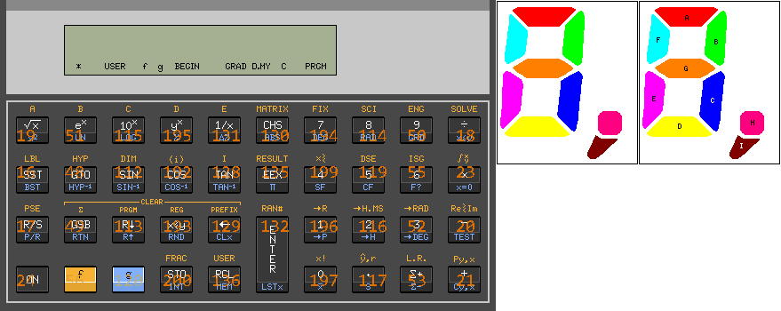

# esp15c - 🚧 Work in progress! 🚧
 ESP32 port of [Eric Smith's Nonpareil](https://nonpareil.brouhaha.com/) calculator emulator, currently planned to only support HP 15c.  
 Based on [an early iPhone port by Tom Fors](https://code.google.com/archive/p/hpcalc-iphone/).

## Current status
Emulation seems to be working well. LCD and keyboard driver is done.  
**Any line commented with *debug* is buggy, added to make everything work for now *(bodging)*, or completely malfunctioning. Contributions are very welcomed.**

### Installation
Download any library that is missing from Arduino IDE, use [Arduino ESP32 filesystem uploader](https://github.com/me-no-dev/arduino-esp32fs-plugin) to upload 15c ROM into SPIFFS *(since no uploader is available for LittleFS so far)*, then reset & check Serial Monitor.

### Request a keypress in Serial
Use this photo to find the keycode you need:  

### Attach a screen
Change U8g2 constructor in [esp15c.ino](../esp15c.ino), check the wirings [here](PinDefs.md).

### Attach a keyboard
Check the wirings [here](PinDefs.md).  
Setting up a key matrix is kind of tricky. Modify *keycodeMap* in *[Kbd_8x5_CH450.h](../Kbd_8x5_CH450.h)* to change mapping.

## Why ESP32?
- ESP32 has more RAM than ESP8266, enough for 15c's ROM and dozens of registers
- ESP32 costs no more than 1 dollar compared to ESP8266
- ESP32 has more GPIOs, freeing us from IO expanders

### Can we support ESP8266 later?
I'm too lazy to optimize RAM consumptions or even implement page files. Feel free to do it on your own. :)

## Components
- 1x ESP32
- 1x CH450 keyboard scanner chip
- 40x keys
- 1x 12864 LCD or anything that is 1. big enough and 2. supported by U8g2 library.
